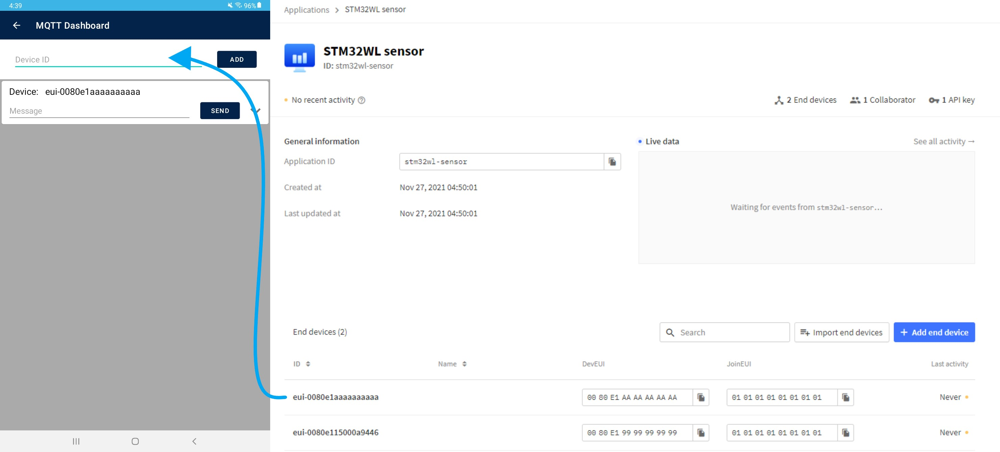
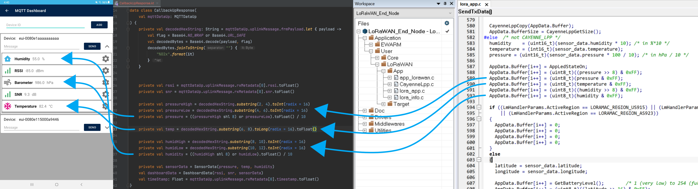

# The Things Stack MQTT Android App for STM32WL

   

The STM32WL-LoRaWAN-MQTT-Android is an application created in Android Studio by ST Microelectronics for mobile devices running Android. The app serves as an example of using the MQTT network protocol on Android to retrieve sensor data from devices connected to the same MQTT network. It allows users to log-in and connect to the [Things Network](https://www.thethingsnetwork.org). From there, the user can add multiple devices using their device ID and view the latest sensor data from each device.

## Application Details

* App Name: MQTT Demo
* App Version: 1.0.1
* Package: com.example.mqttdemo

- Minimum Android SDK: 21 (Android 5)
- Target Android SDK: 26 (Android 8)

* 100% Kotlin

- Tested on the Following Devices:
    * Samsung Galaxy Tab A7 Lite

## Permissions

* WAKE_LOCK
* INTERNET
* ACCESS_NETWORK_STATE
* READ_PHONE_STATE

## Dependencies

* Material
* Core-KTX
* RecyclerView
* Gson
* [Paho MQTT Client](https://github.com/eclipse/paho.mqtt.android)
* [Paho Android Service](https://github.com/eclipse/paho.mqtt.android)
* [Timber](https://github.com/JakeWharton/timber)

## Software
* [Android APK](Utilities/APK)
* LoRaWAN_End_Node Project in [STM32Cube_FW_WL](https://www.st.com/en/embedded-software/stm32cubewl.html)
* [ST Nucleo Lora GW FW](https://www.thethingsnetwork.org/docs/gateways/st/)

## Hardware
* [NUCLEO-WL55JC1](https://www.st.com/en/evaluation-tools/nucleo-wl55jc.html)
* [P-NUCLEO-LRWAN2](https://www.st.com/en/evaluation-tools/p-nucleo-lrwan2.html)
    * NUCELO-STM32F746
    * LRWAN_GS_HF1 (RisingHF ARDUINO Expansion Board)

## Setup User Guide
1. Go to the [Things Stack](https://nam1.cloud.thethings.network/console) on the Things Network and create a new account or use an existing one.
2. Create a new application on the Things Stack Console.
3. Create a API key for the password used by the mobile app.
4. Follow this [video](https://www.youtube.com/watch?v=vuc6914B0KM&list=PLnMKNibPkDnHZyJtMRpWSs41CWhPouRwq&index=1) to learn how to setup the gateway.
5. Follow this [video](https://www.youtube.com/watch?v=8KNfrWoa1fw&list=PLnMKNibPkDnHZyJtMRpWSs41CWhPouRwq&index=3) to learn how to setup the end node and add an end device.
    * The end device(s) will be sending the sensor data to the MQTT network.

## App User Guide
1. Download the APK and install it on a mobile device running the minimum supported Android version.
    * You may need to change a setting on the mobile device that allows the installation of "unknown apps" to install the APK.

   

2. Open the application and enter the log-in information to connect to the [Things Network](https://nam1.cloud.thethings.network/console).
    * Select 1 of 3 available Host URIs (North America, Europe, or Australia).
    * Enter the user name *{Things Network Application ID}@{Tenant ID}* ([Check this document for more information](https://www.thethingsindustries.com/docs/integrations/mqtt/#note-on-using-the-tenant-id)).
    * Enter the password created as an API Key on the Things Stack console.

   

3. Once connected to the MQTT network, enter the device ID from a end device on the Things Stack console and tap add to subscribe to that device's topic.
    * Multiple devices can be added to the application.

   

4. Tap on the arrow icon to view the latest sensor data from the device.
    * Tap on the setting (cogwheel) icon to convert the sensor data units. 
        * Example: Celsius <-> Fahrenheit
5. The image above shows the sensor data path from the LoRaWAN_End_Node project to the Android project and to the mobile dashboard.
    * The LoRaWAN_End_Node project performs a few operations on the sensor data before adding it to a buffer to send to the Things Network.
    * The CallbackUpResponse class in the Android project takes the recieved sensor data and reverses the operations before displaying the data on the dashboard to the user.
6. Enter a hexadecimal message and tap send to send a MQTT downlink message to that device topic.

## Troubleshooting

**Caution** : Issues and pull-requests are **not supported** to submit problems or suggestions related to the software delivered in this repository. The MQTT Demo example is being delivered as-is, and not necessarily supported by ST.

**For any other question** related to the product, the hardware performance or characteristics, the tools, the environment, you can submit it to the [ST Community](https://community.st.com/s/).

**Known Issues** : There is a known issue with Eclipse's Paho MQTT library that may cause an application crash when running on Android SDK 31 ([More Info](https://github.com/eclipse/paho.mqtt.android/issues/465)).
